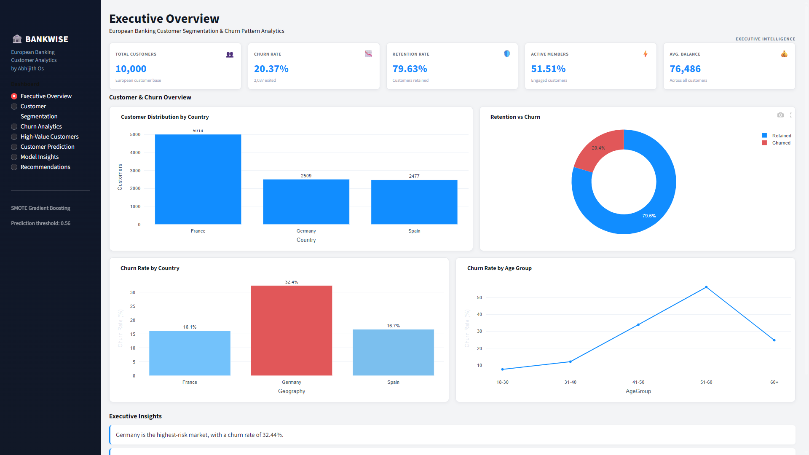
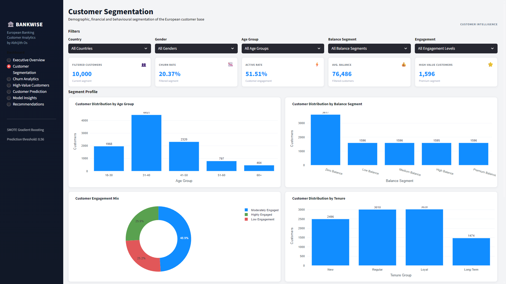
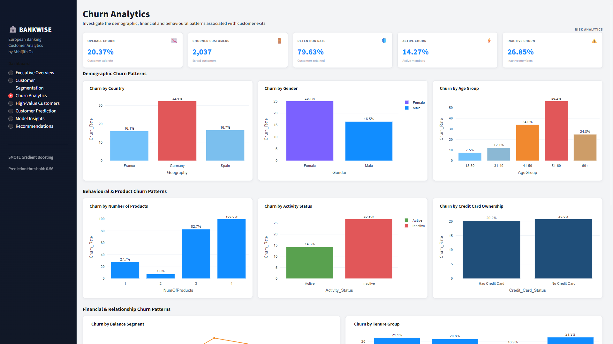
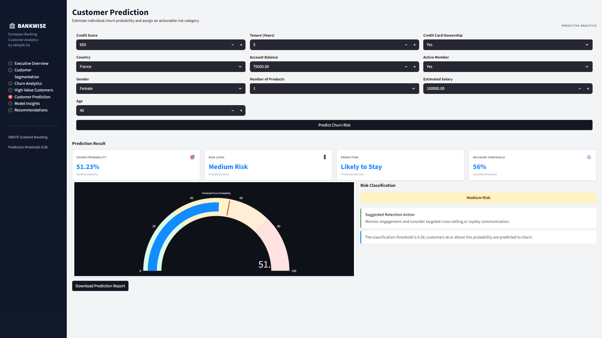
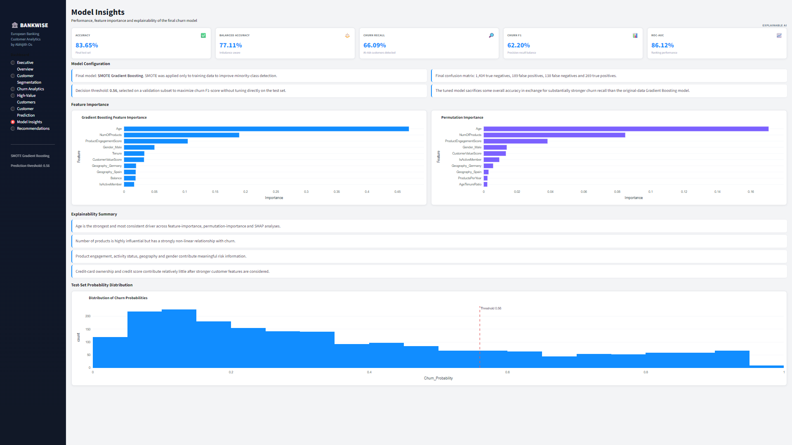

# 🏦 European Banking Customer Segmentation & Churn Analytics

> End-to-End Machine Learning Customer Churn Prediction System with Explainable AI and Interactive Power BI-Style Dashboard


---

## 📌 Project Overview

Customer churn is one of the most critical challenges in the banking industry. Retaining existing customers is significantly more cost-effective than acquiring new ones.

This project develops a complete Machine Learning pipeline capable of identifying customers who are likely to leave the bank before they actually churn.

The solution combines:

- Data Cleaning
- Exploratory Data Analysis
- Feature Engineering
- Machine Learning
- Explainable AI
- Customer Risk Segmentation
- Interactive Business Dashboard

The final application enables business users to understand customer behaviour, identify high-risk customers, explore churn patterns, and predict churn probability for new customers using an intuitive Power BI-inspired dashboard.

---

# 🚀 Live Demo

🔗 **Streamlit App**

https://customersegmentationchurnbanking-knxgjlffk7ebptfgwc6daf.streamlit.app/

---

# 📸 Dashboard Preview

## Executive Overview



---

## Customer Segmentation



---

## Churn Analytics



---

## Customer Prediction



---

## Model Insights



---

# 📂 Project Structure

```text
Customer_Segmentation_Churn_Banking/

│
├── app/
│   ├── app.py
│   └── assets/
│
├── data/
│   ├── bank_customer_churn.csv
│   ├── bank_customer_churn_enriched.csv
│   └── prediction_results.csv
│
├── models/
│   ├── final_model.pkl
│   ├── scaler.pkl
│   └── threshold_metadata.pkl
│
├── notebooks/
│   ├── 01_Data_Loading_and_Validation.ipynb
│   ├── 02_Data_Cleaning_and_Preparation.ipynb
│   ├── 03_Exploratory_Data_Analysis.ipynb
│   ├── 04_Feature_Engineering.ipynb
│   ├── 05_Machine_Learning_Model_Development.ipynb
│   ├── 06_Model_Explainability.ipynb
│   └── 07_Streamlit_Preparation.ipynb
│
├── screenshots/
├── reports/
├── requirements.txt
└── README.md
```

---

# 📊 Dataset

**Source**

European Banking Customer Churn Dataset

### Records

- Customers : 10,000

### Features

- Credit Score
- Geography
- Gender
- Age
- Tenure
- Balance
- Number of Products
- Credit Card Status
- Active Member Status
- Estimated Salary
- Churn Status

---

# ⚙ Machine Learning Pipeline

## Phase 1

- Data Validation

## Phase 2

- Data Cleaning
- Missing Value Verification
- Duplicate Detection

## Phase 3

- Exploratory Data Analysis
- Business Insights
- Customer Segmentation

## Phase 4

Feature Engineering

Engineered Features

- BalanceSalaryRatio
- ProductsPerYear
- AgeTenureRatio
- ActiveBalance
- ProductEngagementScore
- CustomerValueScore

---

## Phase 5

Machine Learning

Models Trained

- Logistic Regression
- Decision Tree
- Random Forest
- Extra Trees
- Gradient Boosting

Training Strategies

- Original Dataset
- SMOTE Oversampling
- Class Weighting

Model Selection

✅ Final Model

**SMOTE Gradient Boosting**

Threshold Optimized

**0.56**

---

## Phase 6

Explainable AI

Implemented

- Feature Importance
- Permutation Importance
- SHAP Values
- Customer Risk Segmentation

---

## Phase 7

Deployment Preparation

Generated

- Final Model
- Feature List
- Numerical Scaler
- Prediction Dataset
- Threshold Metadata

---

# 📈 Final Model Performance

| Metric | Score |
|---------|-------|
| Accuracy | 83.65% |
| Balanced Accuracy | 77.11% |
| Precision | 58.73% |
| Recall | 66.09% |
| F1 Score | 62.20% |
| ROC-AUC | 86.12% |
| PR-AUC | 69.78% |

---

# 📊 Dashboard Features

✔ Executive Overview

✔ Customer Segmentation

✔ Churn Analytics

✔ High Value Customers

✔ Customer Prediction

✔ Model Insights

✔ Business Recommendations

---

# 💡 Key Business Insights

- Germany exhibits the highest observed churn rate.
- Customers aged 51–60 show the highest churn propensity.
- Customers with exactly two banking products demonstrate the strongest retention.
- Inactive customers are substantially more likely to churn than active customers.
- SHAP analysis identifies Age as the most influential predictor of churn.

---

# 🛠 Technologies Used

### Programming

- Python

### Machine Learning

- Scikit-Learn
- Imbalanced-Learn

### Data Processing

- Pandas
- NumPy

### Visualization

- Plotly
- Matplotlib

### Explainable AI

- SHAP

### Deployment

- Streamlit

---

# ▶ Installation

```bash
git clone https://github.com/AkkuOS/Customer_Segmentation_Churn_Banking

cd Customer_Segmentation_Churn_Banking

pip install -r requirements.txt

streamlit run app/app.py
```

---


# 👨‍💻 Author

**Abhijith Os**

Machine Learning Enthusiast

- GitHub: https://github.com/AkkuOS
- LinkedIn: https://www.linkedin.com/in/abhijith-os-207016194/

⭐ If you found this project useful, consider giving it a star.